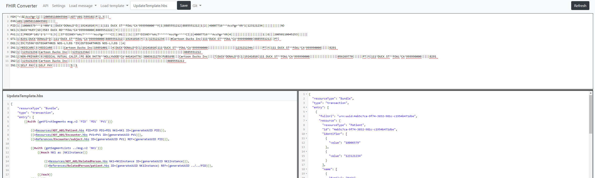
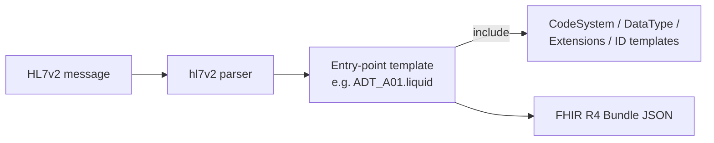

# fhir-converter-liquid

[](https://github.com/gjergjsheldija/fhir-converter-liquid/actions/workflows/ci.yml)
[](LICENSE)
[](package.json)

**HL7v2 &rarr; FHIR R4, powered by [Liquid](https://shopify.github.io/liquid/) templates.**

A standalone conversion service, API-, and template-editor-compatible with [Microsoft's FHIR Converter](https://github.com/microsoft/FHIR-Converter) template library — point it at the official Liquid templates (or your own) and get FHIR R4 bundles out.



## Contents

- [Features](#features)
- [Quick start](#quick-start)
- [Web UI](#web-ui)
- [API](#api)
- [Working with Liquid templates](#working-with-liquid-templates)
- [Configuration](#configuration)
- [Docker](#docker)
- [Project layout](#project-layout)
- [Contributing](#contributing)

## Features

**Conversion**
- HL7v2 → FHIR R4, with templates for every major trigger-event family: `ADT`, `BAR`, `DFT`, `MDM`, `OMG`, `OML`, `ORM`, `ORU`, `OUL`, `RDE`, `RDS`, `REF`, `SIU`, `VXU`
- Per-request template overrides — test a template change against real data without touching what's stored on the server
- Diagnostics on demand: `unusedSegments` (data the template ignored) and `invalidAccess` (fields the template reached for but weren't there)
- Timezone-aware date/time conversion via request header

**Serving & tooling**
- REST API with interactive OpenAPI/Swagger docs (`/api-docs`)
- Browser-based template editor (CodeMirror) with live message → FHIR preview and sample data/templates to try it against
- Async, queue-driven conversion over AMQP (Apache ActiveMQ Artemis via `rhea`) for pipeline integration — optional, off by default
- Prometheus metrics, structured logging, `/health` and `/version` endpoints
- Multi-stage Docker build (prod / dev / test) with a docker-compose + Makefile workflow

## Quick start

**Install**

```bash
npm ci
cp .env.example .env   # tweak PORT, CONVERSION_TIMEOUT_MS, LOG_LEVEL if needed
```

**Run**

```bash
npm start               # serves on http://localhost:2019
```

**Test**

```bash
npm test                # unit tests (mocha + nyc coverage)
npm run eslint          # lint
```

**Convert a message**

```bash
# Convert an HL7v2 ADT^A01 message using the built-in template
curl -X POST http://localhost:2019/api/v1/convert/hl7v2/ADT_A01 \
  -H "Content-Type: text/plain" \
  --data-binary @src/sample-data/hl7v2/ADT01-23.hl7
```

## Web UI

Open `http://localhost:2019` for the browser-based editor:

1. Paste an HL7v2 message, or load one from the sample-data dropdown
2. Pick a template — the FHIR output re-renders live as you edit either side
3. Use the **API** tab for the same Swagger UI served at `/api-docs`, and the settings gear for dark mode

> Edits made in the browser editor are a live preview only — they aren't persisted back to the server (there's no save endpoint). To ship a template change, edit the file under `src/service-templates/` and redeploy, or pass it as a `templatesOverrideBase64` override on the convert call.

## API

All endpoints are versioned under `/api/v1`. Full interactive reference: `GET /api-docs` (Swagger UI) / `GET /api-docs.json` (raw OpenAPI spec).

| Method | Path | Description |
|--------|------|-------------|
| GET | `/api/v1/parsers` | List available source-data parsers |
| GET | `/api/v1/templates` | List templates on the server |
| GET | `/api/v1/templates/{file}` | Fetch a specific template's contents |
| GET | `/api/v1/sample-data` | List bundled sample messages |
| GET | `/api/v1/sample-data/{file}` | Fetch a specific sample message |
| POST | `/api/v1/convert/{srcDataType}` | Convert data using an inline template (`templateBase64`, plus optional `templatesOverrideBase64`) passed in the request body |
| POST | `/api/v1/convert/{srcDataType}/{template}` | Convert data using a template already stored on the server |
| GET | `/health` | Liveness check |
| GET | `/version` | Build version |

Useful query/header options on the convert endpoints:

| Name | Where | Effect |
|------|-------|--------|
| `unusedSegments=true` | query | Include segments present in the source but never accessed by the template |
| `invalidAccess=true` | query | Include fields the template tried to read that didn't exist |
| `timezone` | header | Normalize date/times to a given IANA/offset timezone, e.g. `America/New_York` or `+0400` |

```bash
curl -X POST "http://localhost:2019/api/v1/convert/hl7v2/ADT_A01?unusedSegments=true&invalidAccess=true" \
  -H "Content-Type: text/plain" \
  -H "timezone: Europe/Berlin" \
  --data-binary @message.hl7
```

## Working with Liquid templates

Conversion is entirely template-driven: an **entry-point template** (one per message type, e.g. `ADT_A01.liquid`) renders the FHIR bundle by pulling in smaller, reusable **component templates** via Liquid's `include`.



**Where they live:**

| Path | Contents |
|------|----------|
| `src/templates/Hl7v2/` | Microsoft's base HL7v2 Liquid templates (entry points + `CodeSystem`, `DataType`, `Extensions`, `ID` includes) |
| `src/service-templates/Hl7v2/` | The templates actually served/used at runtime — regenerated from `templates/` on startup by `src/init-service.js`; edit here to customize |
| `src/sample-data/hl7v2/` | Sample messages used by the web UI and for local testing |

**This project is template-compatible with [microsoft/FHIR-Converter](https://github.com/microsoft/FHIR-Converter)** — because it uses the same Liquid syntax and the same `hl7v2FHIR`-style helper filters, you can:

- Drop newer or additional templates straight from Microsoft's repo into `src/service-templates/Hl7v2/` — no code changes needed
- Author your own templates the same way: start from an existing `.liquid` file, use `` to reuse the shared building blocks, and reference [Liquid's own syntax docs](https://shopify.github.io/liquid/) plus the [HL7 v2-to-FHIR mapping project](https://confluence.hl7.org/display/OO/2-To-FHIR+Project) for field-level guidance
- Iterate fast with the web UI (instant preview) or with `templatesOverrideBase64` on `POST /api/v1/convert/{srcDataType}` (test one or more templates against real data with nothing written to disk)
- Use `unusedSegments`/`invalidAccess` on a convert call to spot exactly what your template is missing or mis-referencing in the source message

## Configuration

`.env` (see `.env.example`):

| Variable | Default | Purpose |
|----------|---------|---------|
| `PORT` | `2019` | HTTP port |
| `CONVERSION_TIMEOUT_MS` | `30000` | Per-message conversion timeout |
| `LOG_LEVEL` | `info` | Winston log level |

`config/default.json` (loaded via `nconf`, overridable by env vars) controls the optional AMQP integration:

| Key | Purpose |
|-----|---------|
| `enable_message_broker` | Turn on queue-driven conversion (off by default) |
| `input_queue_name` / `output_queue_name` | Queues consumed/produced when enabled |
| `message_broker.*` | Broker host/port/credentials |
| `max_retries` | Retry attempts for a failed conversion before giving up |

## Docker

```bash
make build   # builds runner + dev images
make start   # docker-compose up the runner image on :2019
make test    # runs the test-stage image (lint + unit tests)
```

## Project layout

```
src/
├── routes.js               # Express routes + Swagger annotations
├── lib/
│   ├── parsers/             # hl7v2 source parser
│   ├── liquid-converter/    # Liquid rendering engine
│   ├── outputProcessor/     # Post-processing of rendered output into FHIR JSON
│   ├── workers/             # Worker-pool for CPU-bound conversion
│   └── message-broker/      # Optional AMQP queue integration
├── templates/Hl7v2/         # Base Microsoft Liquid templates
├── service-templates/       # Templates served at runtime (regenerated from templates/)
├── sample-data/             # Bundled sample HL7v2 messages
└── static/                  # Web UI (HTML/CSS/JS, CodeMirror editor)
```

## Contributing

See [CONTRIBUTING.md](CONTRIBUTING.md).

## License

MIT — see [LICENSE](LICENSE). Built on template and conversion code from Microsoft's [FHIR Converter](https://github.com/microsoft/FHIR-Converter), also MIT-licensed.
