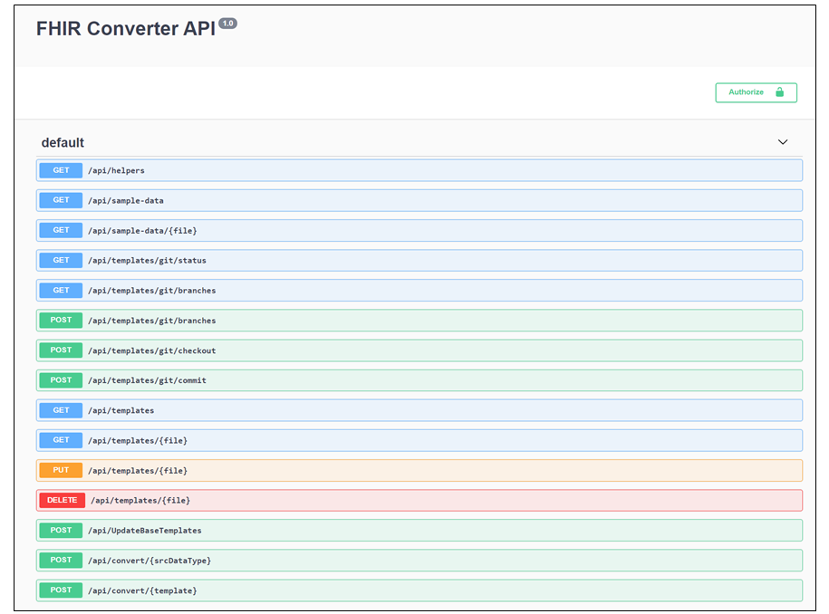

# API

Under the API tab on the main page of the web UI, you can see the list of all available Get, Post, Put, and Delete functions. For each of the API calls below, you can click on the row to see details about the function, view the parameters required, and test it out.

The API is secured using an API Key.

## API Details

| Function | Syntax                    | Details                                         |
|----------|---------------------------|-------------------------------------------------|
|GET       |/api/helpers               |Lists available Liquid filters                   |
|GET       |/api/parsers               |Lists available template parsers                 |
|GET       |/api/sample-data           |Lists available data                             |
|GET       |/api/sample-data/{file}    |Returns specified data                           |
|GET       |/api/templates             |Lists available templates                        |
|GET       |/api/templates/{file}      |Returns a specific template                      |
|PUT       |/api/templates/{file}      |Stores a template in the template store          |
|DELETE    |/api/templates/{file}      |Deletes a template                               |
|POST      |/api/UpdateBaseTemplates   |Updates base templates (deletes existing data). This should be used only when latest version of templates needs to be pulled.
|POST      |/api/convert/{srcDataType} |Takes data, and temporary templates as input and outputs FHIR data after applying the templates on the data. The entry-point template is passed base64-encoded in templateBase64 parameter, whereas other overriding templates are passed in the templatesOverrideBase64 parameter.  templatesOverrideBase64 is a base64-encoded json object containing map between the template name and the template content. You can also set `unusedSegments` and `invalidAccess` parameters in the query string to fetch UI-related segments. Adding `timezone` in the header will convert the date times according to the provided timezone|
|POST      |/api/convert/{template}    |Takes data and converts to FHIR using the {template} that is stored on the server. You can also set `unusedSegments` and `invalidAccess` parameters in the query string to fetch UI-related segments. Adding `timezone` in the header will convert the date times according to the provided timezone|
