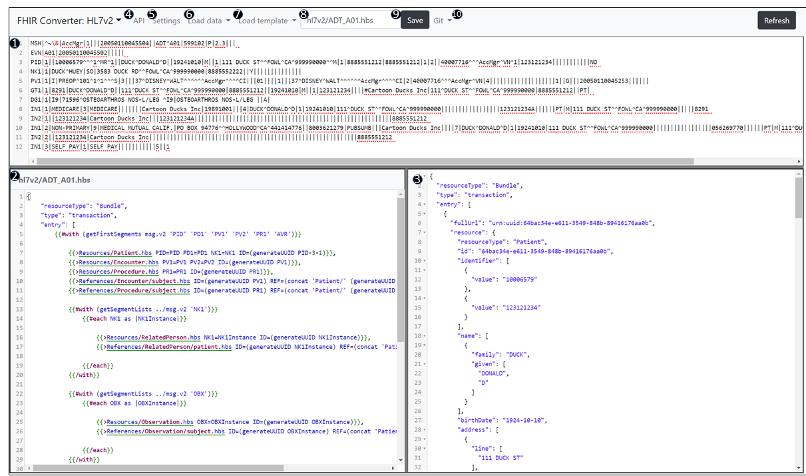

# Web UI Summary

The FHIR Converter includes a web UI for editing and testing Liquid templates.

## HL7v2 Web UI

Below is a screenshot of the web UI with an overview of the key functionality.

| Area | Name | Overview of Functionality |
|------|------|---------------------|
| 1 | Message Input | Displays the HL7v2 message being converted. You can paste any HL7v2 message or load from the sample messages dropdown |
| 2 | Display Template | Liquid template based on selection in #7. The template can be edited in this window |
| 3 | FHIR Output | FHIR bundle output of the message in #1 using the template in #2 |
| 4 | API | Swagger UI for available APIs |
| 5 | Settings | UI settings including dark mode and API key configuration |
| 6 | Load Message | Select pre-loaded test messages for testing |
| 7 | Load Template | Select available templates |
| 8 | Current Template | Shows which template is currently displayed; allows renaming for save |
| 9 | Save Template | Saves updates to the displayed template |
| Refresh | Refresh | Reloads templates modified in parallel sessions |

## Usage

1. Select or paste an HL7v2 message in the input area
2. Select a template from the dropdown
3. View the FHIR output in real-time
4. Edit the template as needed and save changes
